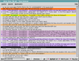
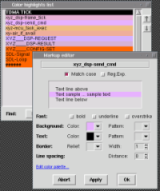
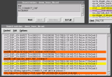
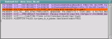
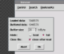

# Trowser

trowser is a browser for large line-oriented text files with color
highlighting, written in [Tcl/Tk](http://tcl.tk/), or alternatively
[Python](https://www.python.org/). It's meant as an alternative to "less".
Compared to less, trowser adds color highlighting, a persistent search history,
graphical bookmarking, separate search result (i.e. filter) windows and
flexible skipping of input from pipes to STDIN.  Trowser has a graphical
interface, but is designed to allow browsing via the keyboard at least to the
same extent as less. Key bindings and the cursor positioning concept are
derived mainly from vim.

Note: in this context "line-oriented" denotes that each line of text is
considered a data unit.  Color highlighting (including search matches)
will always apply the highlight to the complete text line.

Note the Python version is equivalent to the Tcl/Tk version (except for yet
missing support for loading from STDIN, i.e. parameter "-"). Mixed use of both
versions is currently not possible due to different format of the configuration
file. The installation procedure below only supports the Tcl/Tk version yet.

## Screenshots

    

The screenshots (see images sub-directory for larger versions) show some of the main features:

<UL>
<LI>The first screenshot shows the main window with a text which has color
highlighting applied and an ongoing incremental search (for an expression
which matches the line marked in yellow) plus three bookmarked text lines;
<LI>The second screenshot shows the highlight pattern editor dialog
(holding the patterns used for the previous screenshot);
<LI>The third screenshot shows the search history dialog (i.e. a list of
previously used search patterns) and the search result list (the list is
filled with all lines matching the three patterns selected in the search
history list shown above; one line is highlighted in yellow as it matches
a new search in the main window);
<LI>The fourth window shows the bookmark list (these are the lines marked
with a blue dot in the first screenshot);
<LI>The last screenshot shows the pipe load dialog which pops up when the
input stream exceeds the buffer size to allow skipping excessive input data.
</UL>

For details and options please refer to the [manual page](trowser.pod)

## Rationale

trowser was developed for sifting through debug output files written
by software under development. Such debug files can get very large;
in the extreme, there could be a line of trace written for every
entered function (e.g. documenting the call and actual parameters)
and one more line every time a function is left. When debugging
complex exceptions, it's often necessary to analyze several hundreds
or thousands of lines of debug trace to understand the cause.

Such analysis usually start by first looking at top-level events
(e.g. stimuli by the environment) and then digging down into the details.
trowser was developed to facilitate this process. Of course one could
also use standard tools such as "grep" or "awk" and "less" or "vim" to tackle
this task, but this way lots of repetitive manual hacking on the command
line is required. For an every-day task, it seems worth to invest some
time into automating the process in a specialized tool.

Additionally, trowser has the capability to
automatically parse data out of the trace file which can be included
in bookmarks and search results list and could easily be extended
in that direction for different applications. With less than 9000
lines of code trowser still is a relatively small application (in
large part thanks to the powerful "text" widget in Tk) so there's only
a low barrier of getting familiar with the source code to allow
extending or adapting the functionality for your own needs.

## Installing

Software Requirements: trowser can be used on all platforms which are
supported by the Tcl/Tk interpreter, i.e. all UNIX variants, Linux,
Mac, and even MS Windows. On the other hand, this means a prerequisite
is installing the Tcl/Tk interpreter:
[tcl.tk](http://tcl.tk/) (version 8.5 or later)

Hardware requirements: trowser loads the complete text into memory (i.e. in
a Tk text widget) and also applies highlighting to the complete text to
allow fast navigation.  Hence when browsing large files, trowser benefits
from using a fast machine and at least 5 times your text size in RAM.

In principle manual installation on UNIX-like systems is very simple:
Just copy the script into /usr/bin (optionally you can remove the ".tcl"
appendix) and the manual page to /usr/share/man/man1. Example:

```
    cp trowser.tcl /usr/bin/trowser
    cp trowser.1 /usr/share/man/man1/trowser.1
```

However it's recommended to properly install the files using a package,
as this will also take care of dependencies and allow easy removal.
If you're using a Debian, Ubuntu or a compatible Linux distribution, you
can create a package using script `create_deb.sh` in the repository.
The script will copy the required files into a local sub-directory `deb`
and then create a package `deb/trowser_1.3-3.deb` which can be installed.
In summary:

```
    bash create_deb.sh
    dpkg -i deb/trowser_1.3-3_all.deb
```

The software is released under the
[GNU General Public License, version 3](http://www.fsf.org/copyleft/gpl.html)

Originally the project homepage was <http://www.nefkom.net/tomzo/prj/trowser/>

## Troubleshooting

If trowser fails to start or aborts with an interpreter error, you should
check if Tcl/Tk is installed and has the required version by entering the
following command line in a terminal window (i.e. in a shell):

```console
    echo 'puts $tcl_patchLevel;exit' | wish
```
In some Tcl/Tk installations "wish" as such may not exist, but instead the
major and minor version are appended to the executable name (e.g."wish8.5".)
In this case, change the third line in the trowser.tcl script file accordingly.

As of writing this (2009), trowser is tested against Tcl/Tk version 8.5.6. If the
above command returns a version older than 8.4.0, you'd have to upgrade
your Tcl/Tk library.
