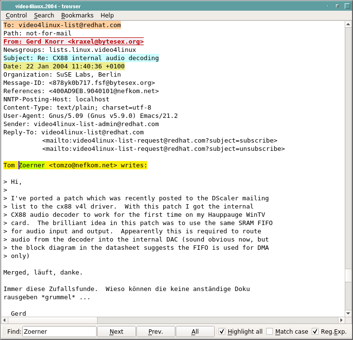
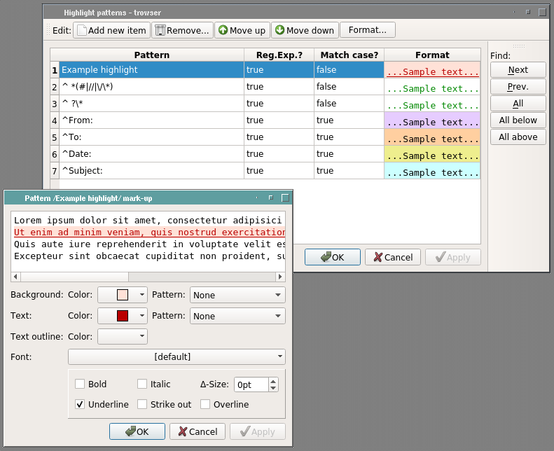
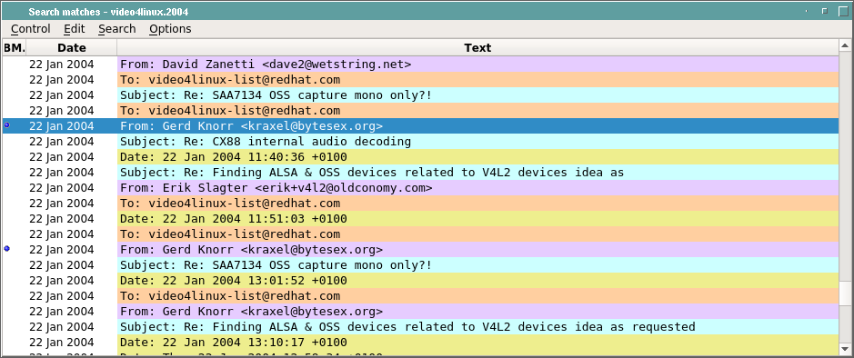
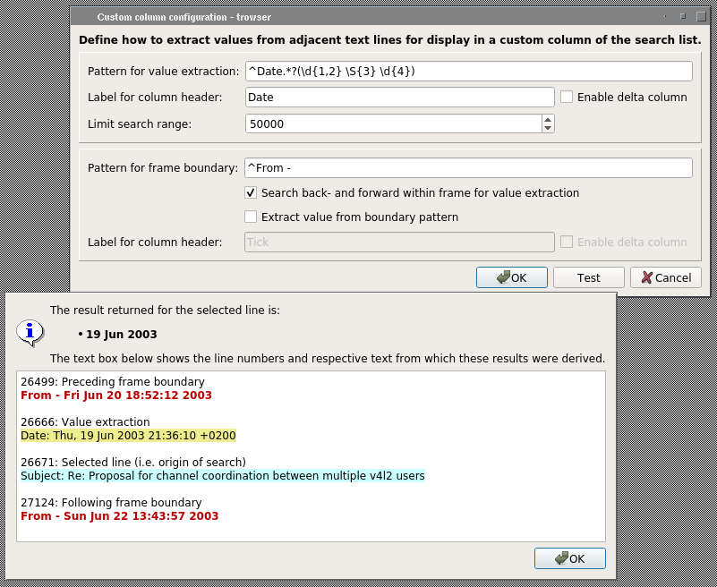
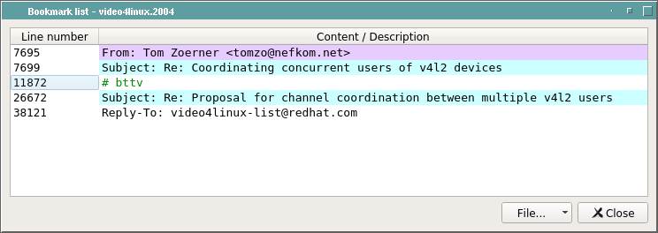
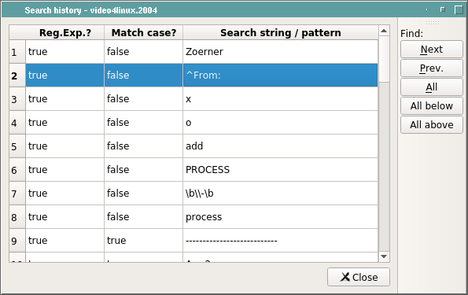
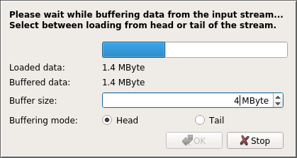

# Trowser

Trowser is a browser for large line-oriented text files with color highlighting
and a highly flexible search and cherry-picking window.  Trowser was developed
as an alternative to UNIX-tool "less" when analyzing debug log/trace files
created by other applications. Trowser integrates well with
[GtestGui](http://github.com/tomzox/gtest_gui) as viewer for text output of test
applications using GoogleTest framework.

Compared to plain text viewers, trowser adds color highlighting, a persistent
search history, graphical bookmarking and a separate search result window. The
search window is especially designed to be main facility for performing trace
analysis: Using multiple consecutive searches, manual additions or removals,
undo/redo and subtractive searches, it can be filled with a condensed view of
the trace file, holding only the lines relevant to the issue under analysis.

Trowser has a graphical interface, but is designed to allow browsing via the
keyboard at least to the same extent as less. Key bindings and the cursor
positioning concept are derived mainly from vim.

Note: In this context "line-oriented" denotes that each line of text is
considered a data unit.  Color highlighting (including search matches)
will always apply the highlight to the complete text line.

Due to historical evolution, implementations of trowser are available in three
different programming languages: [Tcl/Tk](http://tcl.tk/),
[Python](https://www.python.org/), and C++ using [Qt5](https://www.qt.io/).
The three versions are largely equivalent, however the C++/Qt version has best
performance, looks prettier and has a new "column configuration" dialog for the
search list, thus it's recommended to use this version. Currently you'd have to
compile it yourself from the sources in the [src_qt/](src_qt/) sub-directory of
the repository. If you're not up to this, use one of the other versions which
don't need compilation (due to using interpreted languages).

## Screenshots

      

The screenshots, taken from the C++/Qt implementation, show some of the main features
(click the images to see larger versions):

<UL>
<LI>The first screenshot shows the main window with a text which has color
highlighting applied and an ongoing incremental search initiated via the
"Find" toolbar at the bottom of the window.

<LI>The second screenshot shows the highlight pattern editor dialog (holding
the patterns used for the previous screenshot) at the top, and the mark-up
editor sub-dialog at the bottom (which opens when double-clicking on any
"sample text" in the list).

<LI>The third screenshot shows the search result list, populated by "search
all" in the main window, or via the search highlight and history dialogues, or
by manually inserting selected lines from the main window. In the example
screenshot, two lines are bookmarked and thus shown with a leading blue dot. The
"Date" column is filled with content parsed from the document based on the
configuration shown in the next screenshot.

<LI>The fourth screenshot shows the "custom column configuration dialog", which
allows adding columns to the search list: In this example, it is used to extract
the sending date from an email for each line of the email that appears in the
search list. The "Test" dialog shown at the bottom of the image allows debugging
the column configuration by showing results when running it on a selected line.

<LI>The fifth screenshot shows the bookmark list, which are lines that are
individually marked by the user and appear in special mark-up in the main
window and search list.

<LI>The sixth screenshot shows the search history dialog (i.e. a list of
previously used search patterns) which can be used to quickly repeat one or
more previous searches.

<LI>The last screenshot shows the pipe load dialog which pops up when loading
text from standard input. This is used mainly for monitoring progress while
piping output from another application directly into trowser.
</UL>

## Documentation

For a detailed description of features please refer to the [manual page](doc/trowser.pod)

## Rationale

trowser was developed for sifting through debug output files written
by software under development. Such debug files can get very large;
in the extreme, there could be a line of trace written for every
entered function (e.g. documenting the call and actual parameters)
and one more line every time a function is left. When debugging
complex exceptions, it's often necessary to analyze several hundreds
or thousands of lines of debug trace to understand the cause.

Such analysis usually start by first looking at top-level events
(e.g. stimuli by the environment) and then digging down into the details.
trowser was developed to facilitate this process. Of course one could
also use standard tools such as "grep" or "awk" and "less" or "vim" to tackle
this task, but this way lots of repetitive manual hacking on the command
line is required. For an every-day task, it seems worth to invest some
time into automating the process in a specialized tool.

Additionally, trowser has the capability to automatically parse data out
of the trace file which can be included in custom columns of the search
results list. This can be used for example in traces for event-driven
applications to show a common timestamp or ID for each trace line
generated while processing the same event. If the pre-existing custom
configuration doesn't allow your use-case, it is fairly straight-forward
extending it by adding a new sub-class in `src_qt/parse_frame.cc`

With less than 9k lines of Tcl/Tk code, or 16k lines C++ respectively,
trowser still is a relatively small application (in large part thanks to
the powerful "text" widgets both Tk and Qt) so there's only a low barrier
of getting familiar with the source code to allow extending or adapting
the functionality for your own needs.

## Installing C++ version

The C++ version is only tested on Linux so far. Pre-requisite for building the
C++ version is installing Qt5 developer packages (qtbase5-dev, qttools5-dev,
qt5-default). On some platforms, you may additionally need package
`libqt5serialport5-dev`.

To build the C++ version, change into sub-directory `src_qt`, then run
`qmake` and then `make`. If all works well, an executable `build/trowser`
is generated as a result. You can copy this executable file anywhere you want
or just run it directly.

Usage: Name the file to open on the command line, or "-" to read from a pipe.

First steps when running trowser for the first time usually is selection of an
appropriate font and configuring expressions for syntax highlighting under menu
"Search / Edit highlight patterns". Then adjust the window and dialog sizes and
locations. trowser will remember these settings in its configuration file
stored in `$HOME/.config/trowser/`.

## Installing Tcl/Tk & Python versions

Software Requirements: trowser can be used on all platforms which are supported
by either the Tcl/Tk or Python interpreters. This means all UNIX variants,
Linux, Mac, and even MS Windows. On the other hand, this means a prerequisite
is installing either [Tcl/Tk](http://tcl.tk/) (version 8.5 or later) or
[Python](https://www.python.org/). The latter can be done semi-automatically
when creating packages using the scripts described below.

Hardware requirements: trowser loads the complete text into memory (i.e. in
a Tk text widget) and also applies highlighting to the complete text to
allow fast navigation.  Hence when browsing large files, trowser benefits
from using a fast machine and at least 5 times your text size in RAM.

trowser can be used without installation, if you copy the script simply in
the same directory as the files you want to open with it. Note trowser
expects to be given the name of the file you want to open on the command line.

Otherwise, manual installation on UNIX-like systems is also simple:
Just copy the script into /usr/bin (optionally you can remove the ".tcl"
appendix) and the manual page to /usr/share/man/man1.
However it's recommended to properly install the files using a package,
as this will also take care of dependencies and allow easy removal.

If you're using a Debian, Ubuntu or a compatible Linux distribution, you
can create a package for the Tcl/Tk version using script `create_deb.sh`,
or for the Python version using `create_deb_py.sh` respectively.
The scripts will copy the required files into a local sub-directory `deb`
and then create a package (e.g. `deb/trowser_1.3-3.deb`) which can be installed.
In summary:

```console
    bash create_deb.sh
    dpkg -i deb/trowser_1.3-3_all.deb
```

The software is released under the
[GNU General Public License, version 3](http://www.fsf.org/copyleft/gpl.html)

Originally the project homepage was <http://www.nefkom.net/tomzo/prj/trowser/>,
but this page is now defunct.

## Troubleshooting (Tcl/Tk version)

If trowser fails to start or aborts with an interpreter error, you should
check if Tcl/Tk is installed and has the required version by entering the
following command line in a terminal window (i.e. in a shell):

```console
    echo 'puts $tcl_patchLevel;exit' | wish
```
In some Tcl/Tk installations "wish" as such may not exist, but instead the
major and minor version are appended to the executable name (e.g."wish8.5".)
In this case, change the third line in the trowser.tcl script file accordingly.

As of writing this (2009), trowser is tested against Tcl/Tk version 8.5.6. If the
above command returns a version older than 8.4.0, you'd have to upgrade
your Tcl/Tk library.
